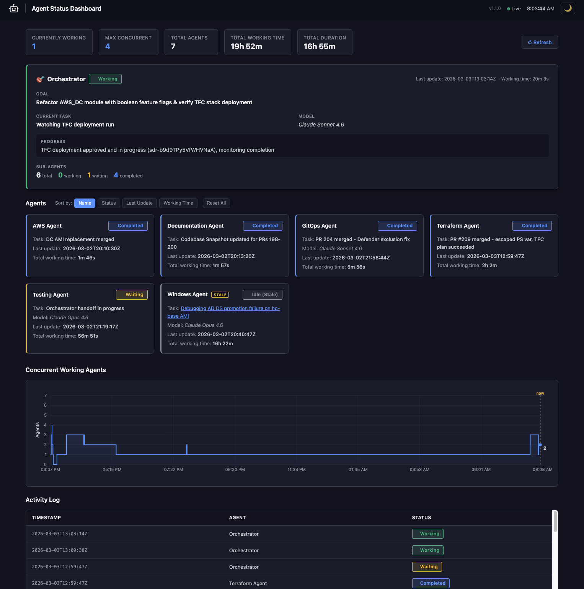

# Agent Status Dashboard

A lightweight, platform-agnostic dashboard for monitoring AI agent status in orchestration workflows. Works with any AI platform — GitHub Copilot, Claude, OpenAI Assistants, LangChain, CrewAI, AutoGen, or custom agents. Agents self-register dynamically by posting status updates—no pre-configuration required.

> **For AI agents / orchestrators:** See [`dashboard-instructions.md`](dashboard-instructions.md) for a concise, machine-readable API reference designed to be included in agent system prompts or tool definitions.

## Features

- **Dynamic Agent Registration** — Agents appear automatically when they post their first status update
- **Multi-Orchestrator Support** — Multiple orchestrators can report to the same dashboard; a filter bar lets operators drill into a specific orchestrator and its agents
- **Orchestrator Panel** — Dedicated panel above agent cards for orchestrating agents, showing goal, progress, and sub-agent status counts
- **Real-time Status Cards** — Visual status for each agent with color-coded badges
- **Task Tracking** — Each card shows the agent's current task, with clickable links to GitHub/GitLab issues
- **Model Display** — Each card shows the AI model being used (e.g. Claude Sonnet 4.5, GPT-4.1)
- **Working Time Tracking** — Tracks total time each agent has spent in "working" status
- **Activity Log** — Last 100 status changes with timestamps
- **Concurrency Chart** — Canvas-based visualization of concurrent working agents over time
- **Staleness Detection** — Agents stuck in "working" beyond a configurable threshold are automatically shown as "idle (stale)" with a warning tag
- **Lifecycle Management** — When an AI session ends, it can trigger a modal giving the operator a choice: keep the dashboard running, shut it down with data, or shut it down and delete data
- **Light/Dark Theme** — Theme toggle (light, dark, system) with `localStorage` persistence
- **No External Dependencies** — Pure Python/Flask with vanilla JavaScript



## Quick Start

### Docker (Recommended)

```bash
# Run with persistent SQLite storage
docker run -d \
  -p 5050:5050 \
  -v $(pwd)/data:/data \
  ghcr.io/andybaran/agent-status-dashboard:latest

# Open dashboard
open http://localhost:5050
```

### Local Python

```bash
pip install flask
python dashboard.py

# Dashboard available at http://localhost:5050
```

### Try the Demo

Not sure how it works? Run the included multi-agent demo:

```bash
pip install requests

# Start the dashboard (if not already running)
docker run -d -p 5050:5050 -v $(pwd)/data:/data ghcr.io/andybaran/agent-status-dashboard:latest

# Run the 8-agent pipeline demo (~3 min, or ~90s at 2x speed)
python examples/multi_agent_demo.py

# Fast mode
DEMO_SPEED=0.5 python examples/multi_agent_demo.py
```

Watch 8 agents coordinate a data pipeline — collecting, validating, transforming, training, QA (with error retry), reporting, and notifying. See `examples/README.md` for details.

### Integrate Into Your AI Workflow

Copy the example instruction file that matches your AI assistant into your project:

```bash
# For Claude (Claude Code, Anthropic API, etc.)
cp examples/claude.md /path/to/your/project/CLAUDE.md

# For GitHub Copilot
cp examples/copilot-instructions.md /path/to/your/project/.github/copilot-instructions.md
```

Then edit the "Project-Specific Instructions" section to describe your project. The dashboard integration section at the top works as-is — your agents will automatically report status to the dashboard.

## Configuration

Environment variables:

| Variable | Default | Description |
|----------|---------|-------------|
| `DASHBOARD_PORT` | `5050` | Port to run the dashboard |
| `DB_PATH` | `./agent_status.db` | Path to the SQLite database file |
| `CSV_PATH` | (legacy) | Path to legacy CSV file for auto-import on first run |
| `DASHBOARD_TITLE` | `Agent Status Dashboard` | Title shown in the header |
| `STALE_THRESHOLD_MINUTES` | `10` | Minutes before a "working" agent is marked stale |
| `DASHBOARD_LOGO_SVG` | *(robot icon)* | Custom SVG markup for the header logo |
| `DASHBOARD_ACRONYMS` | `UI,API,CI,CD,HCP,VSO,CSI,LDAP,AWS,GitOps` | Comma-separated acronyms preserved during name normalization |

Example:
```bash
DASHBOARD_PORT=8080 DASHBOARD_TITLE="My Agents" STALE_THRESHOLD_MINUTES=60 DASHBOARD_ACRONYMS="UI,API,CI,CD" python dashboard.py
```

## API Reference

### Update Agent Status

```bash
POST /api/update/<agent_name>/<status>
```

**Valid statuses:** `working`, `waiting`, `completed`, `idle`, `blocked`, `error`

**Optional query parameters:**

| Parameter | Description |
|-----------|-------------|
| `task` | Name/description of the current task |
| `task_url` | URL to the task (e.g. GitHub issue, Jira ticket) |
| `model` | AI model being used (e.g. Claude Sonnet 4.5, GPT-4.1) |
| `role` | Agent role — set to `orchestrator` for the orchestrating agent |
| `goal` | Overall objective of the workflow (orchestrator only) |
| `progress` | Brief progress summary (orchestrator only) |
| `orchestrator` | Name of the orchestrator this sub-agent belongs to (multi-orchestrator setups) |

Task info is displayed on the agent's card. If `task_url` is provided, the task
name is rendered as a clickable link. Model is displayed below the task in
italic. All parameters carry forward across status updates until a new value is
provided.

Agents with `role=orchestrator` are displayed in a dedicated panel above the
agent cards, showing goal, progress, and live sub-agent status counts.

**Examples:**
```bash
# Start a task
curl -X POST "http://localhost:5050/api/update/My%20Agent/working"

# Start a task with a name
curl -X POST "http://localhost:5050/api/update/My%20Agent/working?task=Implement+login+form"

# Start a task linked to a GitHub issue
curl -X POST "http://localhost:5050/api/update/My%20Agent/working?task=Fix+auth+bug&task_url=https://github.com/org/repo/issues/42"

# Report the model being used
curl -X POST "http://localhost:5050/api/update/My%20Agent/working?task=Fix+auth+bug&model=Claude+Sonnet+4.5"

# Agent name with spaces (URL-encode)
curl -X POST "http://localhost:5050/api/update/Terraform%20Agent/working"

# Complete successfully
curl -X POST "http://localhost:5050/api/update/My%20Agent/completed"

# Report an error
curl -X POST "http://localhost:5050/api/update/My%20Agent/error"

# Orchestrator — report with goal and progress (displayed in dedicated panel)
curl -X POST "http://localhost:5050/api/update/Orchestrator/working?role=orchestrator&goal=Deploy+v2.0&progress=Spawning+sub-agents&task=Initialize+pipeline&model=Claude+Opus+4.6"

# Orchestrator — update progress
curl -X POST "http://localhost:5050/api/update/Orchestrator/waiting?role=orchestrator&progress=3+of+5+agents+completed"

# Sub-agent in a multi-orchestrator setup — link to a specific orchestrator
curl -X POST "http://localhost:5050/api/update/Code%20Agent/working?task=Implement+feature&orchestrator=My%20Orchestrator"
```

**Response:**
```json
{"ok": true, "agent": "My Agent", "status": "working", "task": "Fix auth bug", "task_url": "https://github.com/org/repo/issues/42", "model": "Claude Sonnet 4.5"}
```

**Orchestrator response:**
```json
{"ok": true, "agent": "Orchestrator", "status": "working", "role": "orchestrator", "goal": "Deploy v2.0", "progress": "Spawning sub-agents"}
```

> **Note:** The returned `agent` field is the *canonical* (normalized) name — see
> [Agent Naming Convention](#agent-naming-convention) below.

### Reset Agents

```bash
POST /api/reset                # Reset ALL currently-working agents to idle
POST /api/reset/<agent_name>   # Reset a specific agent to idle
```

Marks agents as `idle` by inserting a new status row. Only affects agents whose current status is `working`. Useful for cleaning up ghost agents after a session ends or an agent crashes.

**Response:**
```json
{"ok": true, "reset_agents": ["My Agent", "Other Agent"], "count": 2}
```

A "Reset All" button is also available in the dashboard UI header.

### Lifecycle Management

These endpoints let AI agents notify the dashboard when their session is ending,
giving the human operator a choice of what to do with the running dashboard.

```bash
# Trigger the lifecycle prompt modal in the dashboard UI
POST /api/lifecycle/prompt

# Check whether a lifecycle prompt is currently pending
GET /api/lifecycle/status
# Response: {"prompt": true}  or  {"prompt": false}

# Execute a lifecycle action (called by the modal UI — not by agents)
POST /api/lifecycle/execute?mode=<mode>
```

**Lifecycle modes:**

| Mode | Effect |
|------|--------|
| `keep_running` | Dismiss the modal — dashboard keeps running with all data |
| `shutdown_keep` | Dashboard process exits, database file is preserved |
| `shutdown_delete` | Dashboard process exits and database file is deleted |

**Recommended agent usage:** Before sending your final message to the user, call
`POST /api/lifecycle/prompt` and tell the user to check the dashboard. The human
operator then clicks one of the three options in the modal. Do not call
`/api/lifecycle/execute` from agent code.

```bash
curl -s -X POST http://localhost:5050/api/lifecycle/prompt
```

### Export Agent Status as CSV

```bash
GET /api/export/csv
```

Downloads the complete status log as a CSV file with columns: `timestamp,agent_name,status,task_name,task_url,model`.

### Agent Naming Convention

Agent names are **automatically normalized** on both ingest and read so that
formatting variants collapse to a single identity:

| Posted as | Canonical form |
|-----------|---------------|
| `orchestrator-agent` | Orchestrator Agent |
| `orchestrator agent` | Orchestrator Agent |
| `Orchestrator Agent` | Orchestrator Agent |
| `python-agent-01` | Python Agent 01 |

**Rules applied (in order):**

1. Strip leading/trailing whitespace
2. Replace hyphens (`-`) and underscores (`_`) with spaces
3. Collapse multiple spaces
4. Title-case each word
5. Restore known acronyms (configurable via `DASHBOARD_ACRONYMS`): UI, API, CI, CD, HCP, VSO, CSI, LDAP, AWS, GitOps

**Best practice:** Post names in `Title Case` with spaces (e.g. `Research Agent`)
to avoid any ambiguity. Numbered suffixes (e.g. `Python Agent 01`) are preserved
as distinct agents.

```bash
GET /api/status
```

**Response:**
```json
{
  "current": {
    "My Agent": {
      "status": "working",
      "timestamp": "2026-01-15T10:30:00Z",
      "working_seconds": 120,
      "task_name": "Fix auth bug",
      "task_url": "https://github.com/org/repo/issues/42",
      "model": "Claude Sonnet 4.5"
    },
    "Stale Agent": {
      "status": "idle",
      "timestamp": "2026-01-14T08:00:00Z",
      "working_seconds": 7200,
      "stale": true
    }
  },
  "log": [
    {"timestamp": "2026-01-15T10:30:00Z", "agent_name": "My Agent", "status": "working"},
    ...
  ]
}
```

> **Note:** The `stale` field (boolean) appears only on agents whose last database status was `working` but whose last update is older than `STALE_THRESHOLD_MINUTES`. These agents are displayed as "idle (stale)" in the UI.

### Get Concurrency Data

```bash
GET /api/concurrency
```

Returns time-series data for the concurrency chart.

## Docker Compose

```yaml
version: '3.8'
services:
  agent-dashboard:
    image: ghcr.io/andybaran/agent-status-dashboard:latest
    ports:
      - "5050:5050"
    volumes:
      - ./data:/data
    environment:
      - DASHBOARD_TITLE=My Agent Dashboard
    restart: unless-stopped
```

## AI Agent Integration

For AI orchestration systems, have each agent call the API at task boundaries:

```python
import requests

DASHBOARD_URL = "http://localhost:5050"
AGENT_NAME = "My Agent"

def update_status(status: str):
    requests.post(f"{DASHBOARD_URL}/api/update/{AGENT_NAME}/{status}")

# Workflow
update_status("working")
try:
    # ... do work ...
    update_status("completed")
except Exception:
    update_status("error")
```

See `dashboard-instructions.md` for machine-readable agent instructions.

## Status Colors

| Status | Color | Use Case |
|--------|-------|----------|
| `working` | 🟢 Green | Agent is actively processing |
| `waiting` | 🟡 Yellow | Blocked on external dependency |
| `completed` | 🔵 Blue | Task finished successfully |
| `idle` | ⚪ Gray | No active task |
| `blocked` | 🔴 Red | Cannot proceed |
| `error` | 🔴 Red | Task failed |

## Data Persistence

Status data is stored in a **SQLite database** (`/data/agent_status.db` in Docker):
- On startup, the database is created automatically if it doesn't exist
- An indexed `status_log` table stores all status changes (append-only)
- **Write-Ahead Logging (WAL) mode** ensures data durability and concurrent read access
- Indexes on `(agent_name, timestamp)` optimize queries
- If a legacy CSV file exists at `CSV_PATH` on first run, it is automatically imported into the database
- Mount `/data` as a volume to persist the database across container restarts

## FAQ / Troubleshooting

### `PermissionError: [Errno 13] Permission denied` when writing to database

The container runs as a non-root user (UID 1000). If your mounted data directory is owned by a different user, database writes will fail.

**Fix:** Make the data directory writable before starting the container:
```bash
mkdir -p ./data
chmod 777 ./data
```

### `no image found in image index for architecture "arm64"` when pulling

Early builds only included `linux/amd64`. The image now ships multi-platform (`amd64` + `arm64`). Pull the latest tag to get the correct architecture:
```bash
docker pull ghcr.io/andybaran/agent-status-dashboard:latest
```

### Dashboard loads but API POST returns 500

Check the container logs for the root cause:
```bash
docker logs agent-dashboard
```

The most common cause is the database permission issue above. Other possibilities:
- Invalid status value (must be one of: `working`, `waiting`, `completed`, `idle`, `blocked`, `error`)
- Corrupted database file — delete `agent_status.db` and restart; agents will re-register on their next POST

### Container starts but no agents appear

Agents self-register — the dashboard starts empty by design. Post a status update to register an agent:
```bash
curl -X POST "http://localhost:5050/api/update/Test%20Agent/idle"
```

If you previously had data, make sure you mounted the correct directory containing your `agent_status.db`:
```bash
docker run -d -p 5050:5050 -v /path/to/your/data:/data ghcr.io/andybaran/agent-status-dashboard:latest
```

To restore from a legacy CSV, mount a directory containing both `agent_status.csv` (legacy) and ensure `CSV_PATH` is set (e.g. `CSV_PATH=/data/agent_status.csv`). The database will be auto-populated on first startup.

### Port 5050 is already in use

Either stop the existing process or run on a different port:
```bash
# Find what's using port 5050
lsof -ti:5050

# Or run the dashboard on a different port
docker run -d -p 8080:5050 ghcr.io/andybaran/agent-status-dashboard:latest
```

### Agent names with special characters

URL-encode agent names when calling the API. Spaces become `%20`:
```bash
curl -X POST http://localhost:5050/api/update/My%20Agent%20Name/working
```

### Task names are not clickable links on the dashboard

The dashboard renders task names as **clickable links** only when the `task_url` query parameter is provided. If tasks appear as plain text, the agents are not sending `task_url` in their status updates.

**Fix:** Include the `task_url` parameter when posting status updates:
```bash
# With task_url — task name becomes a clickable link
curl -X POST "http://localhost:5050/api/update/My%20Agent/working?task=Fix+auth+bug&task_url=https://github.com/org/repo/issues/42"

# Without task_url — task name is plain text (not recommended)
curl -X POST "http://localhost:5050/api/update/My%20Agent/working?task=Fix+auth+bug"
```

When transitioning between statuses (e.g. `working` → `completed`), **re-send the same `task_url`** so the link remains visible on the card. See the example instruction templates in `examples/claude.md` and `examples/copilot-instructions.md` for the full list of supported URL patterns (GitHub, Jira, Linear, GitLab, etc.) and best practices.

### Agents marked as stale while still actively working

The dashboard marks agents as **idle (stale)** if their last status update is older than `STALE_THRESHOLD_MINUTES` (default: 10). This can happen to agents that are genuinely still working but haven't posted an update in a while.

**Fix:** Agents performing long-running tasks should send **heartbeat check-ins every 2–3 minutes** by re-POSTing their current `working` status with the same parameters:
```bash
# Heartbeat — re-send the same working status to reset the staleness timer
curl -X POST "http://localhost:5050/api/update/My%20Agent/working?task=Train+model&task_url=https://github.com/org/repo/issues/42&model=Claude+Opus+4.6"
```

Update your agent instruction files (`CLAUDE.md`, `.github/copilot-instructions.md`) to include this requirement. See the templates in `examples/` for ready-to-use guidance.

### Agents still show "working" long after they stopped

If an agent crashes or the orchestrator session ends without posting a final `idle` or `completed` status, the dashboard will continue to show the agent as "working." After `STALE_THRESHOLD_MINUTES` (default: 10), the dashboard automatically marks these agents as **idle (stale)** with a warning tag. To adjust the threshold:
```bash
docker run -d -p 5050:5050 -e STALE_THRESHOLD_MINUTES=60 ...
```

To manually clear a stale agent, post an `idle` status:
```bash
curl -X POST "http://localhost:5050/api/update/Stale%20Agent/idle"
```

## Versioning

This project follows [Semantic Versioning](https://semver.org/) (semver). Docker images are tagged with:
- Full version (e.g. `1.0.0`)
- Major.minor version (e.g. `1.0`)
- `latest` (always points to the newest version tag)

To pull a specific version:
```bash
docker pull ghcr.io/andybaran/agent-status-dashboard:1.0.0
docker pull ghcr.io/andybaran/agent-status-dashboard:1.0
docker pull ghcr.io/andybaran/agent-status-dashboard:latest
```

## Contributing / Maintenance Rules

When making changes to this repository:

1. **`README.md`** and **`dashboard-instructions.md`** MUST be updated whenever the API, features, configuration, or behavior changes.
2. **`examples/`** MUST always use the latest dashboard version and API patterns. Update the demo whenever the API changes.
3. Update `CLAUDE.md` and `.github/copilot-instructions.md` for architecture, convention, or workflow changes.

## License

MIT License - Copyright 2026 Andy Baran
